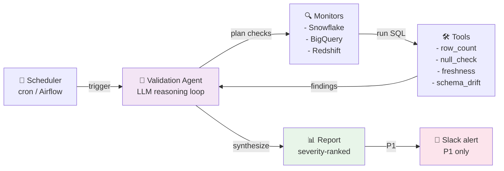
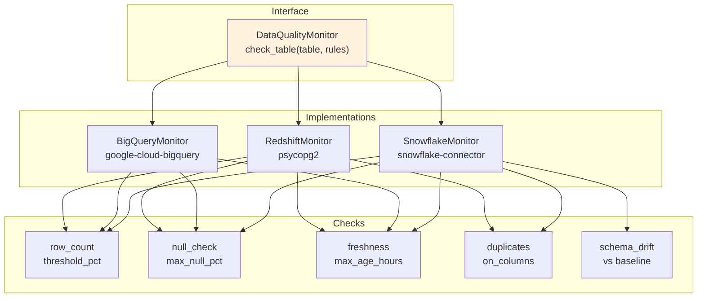
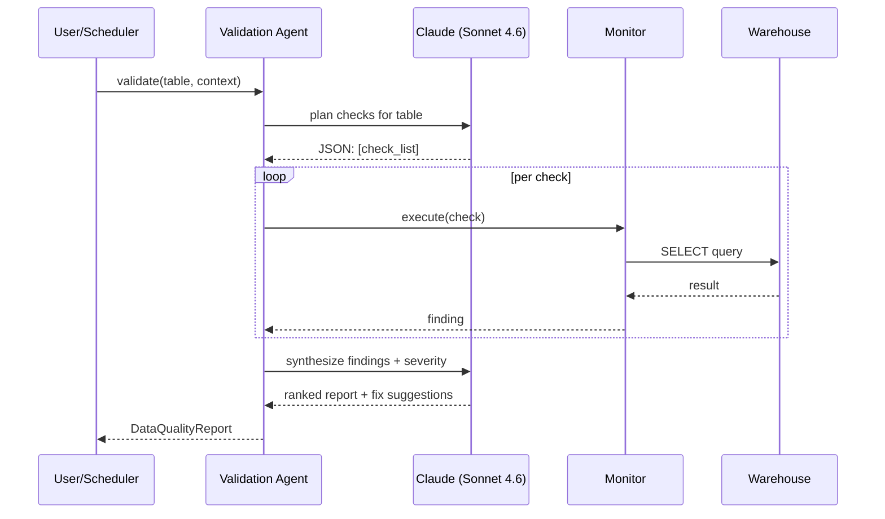

# AI Data Quality Agent — Architecture

LLM-powered data validation agent with multi-warehouse monitoring.

## System Flow

## Monitor Abstraction

## LLM Agent Loop

## Severity Model

| Severity | Trigger | Action |
|----------|---------|--------|
| **P1 CRITICAL** | >10% null on PK, stale >24h, schema drift on PROD | Page on-call + Slack |
| **P2 HIGH** | 1-10% null, stale 12-24h, unexpected row delta | Slack warning |
| **P3 MEDIUM** | <1% null, stale 6-12h | Log + daily digest |
| **P4 INFO** | Baseline drift, new column | Dashboard only |

## Tech Stack

| Layer | Technology |
|-------|------------|
| Agent | Python 3.11, Anthropic SDK, claude-sonnet-4-6 |
| Warehouses | Snowflake, BigQuery, Redshift |
| Orchestration | cron / Airflow / cloud scheduler |
| Alerts | Slack webhooks |
| Storage | JSON reports, Prometheus metrics |
